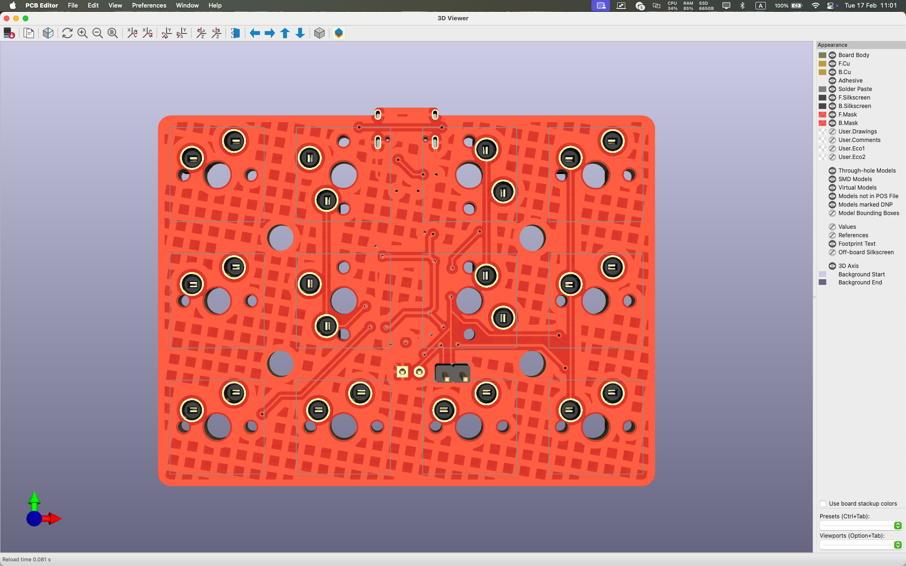
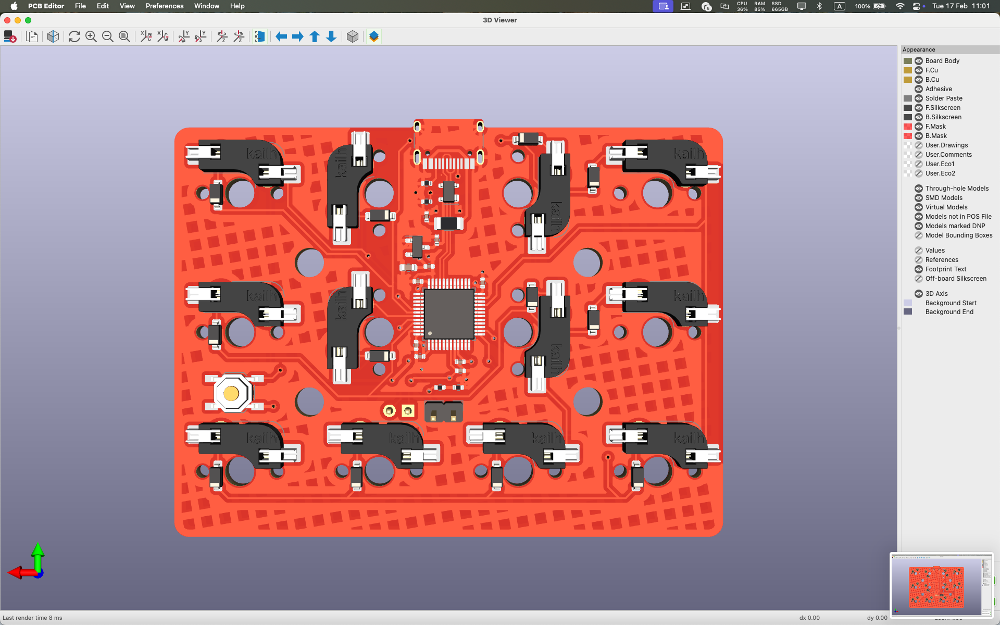
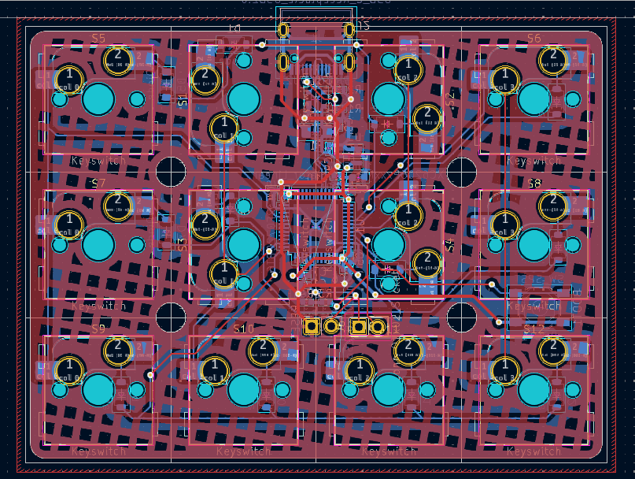
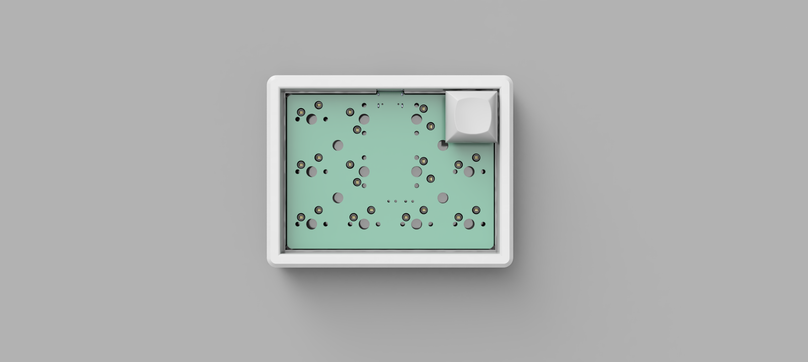
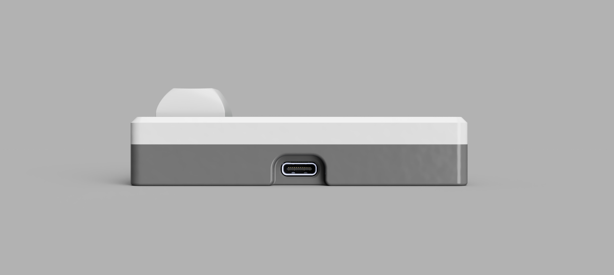
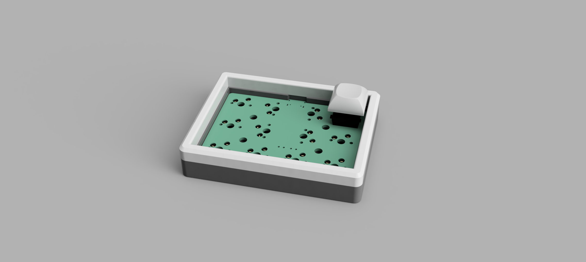
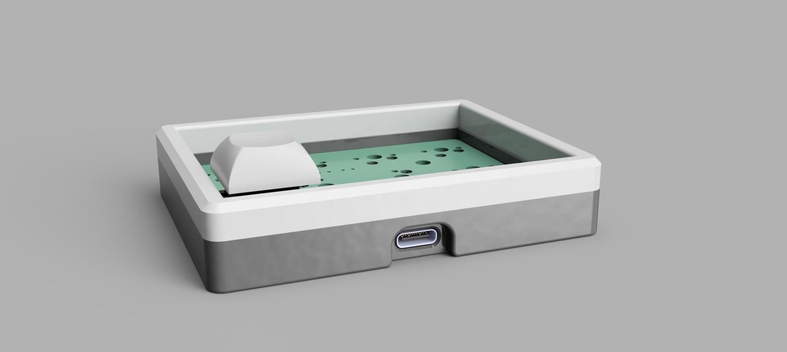

# 4x3 derived

## description 
4x3, four columns and three rows.

Derived, as in derived from the lv2x2 macropad.

PCB tested, functioning properly as a macropad. This design was ordered as a plain pcb without any assembly service. A Yihua hot air gun was used to solder all components except for the diodes and the hotswap sockets.

 

## pics
| | |
| --- | --- |
|  | |
|  | |
|  | |
|  | |

 

## firmware

Use [QMK toolbox](https://qmk.fm/toolbox) to flash the pre-compiled `.bin`. Source files to be uploaded.
