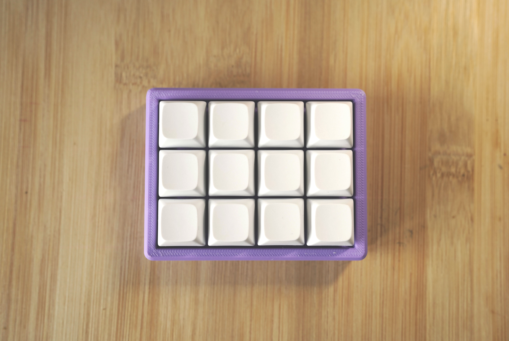
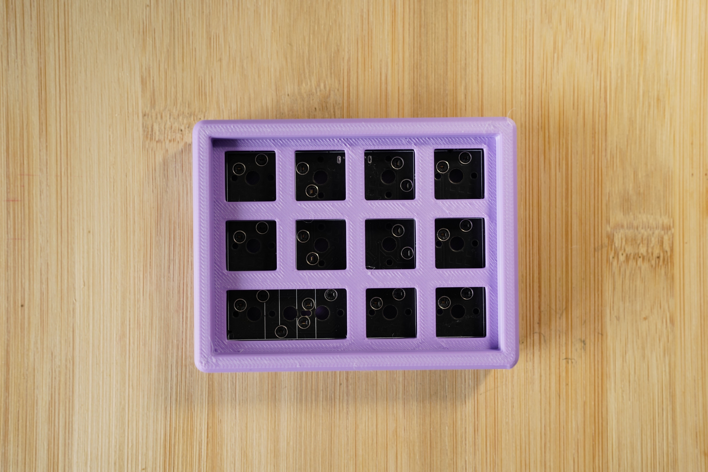
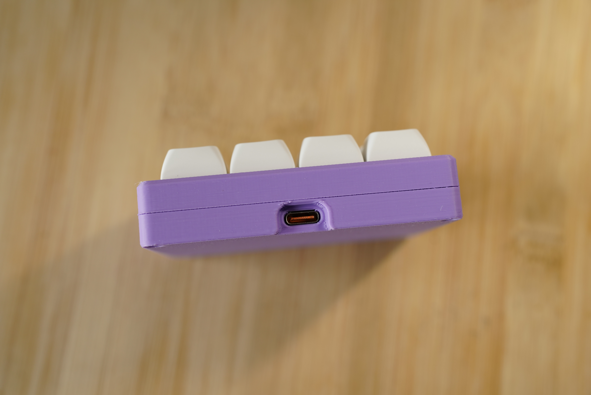
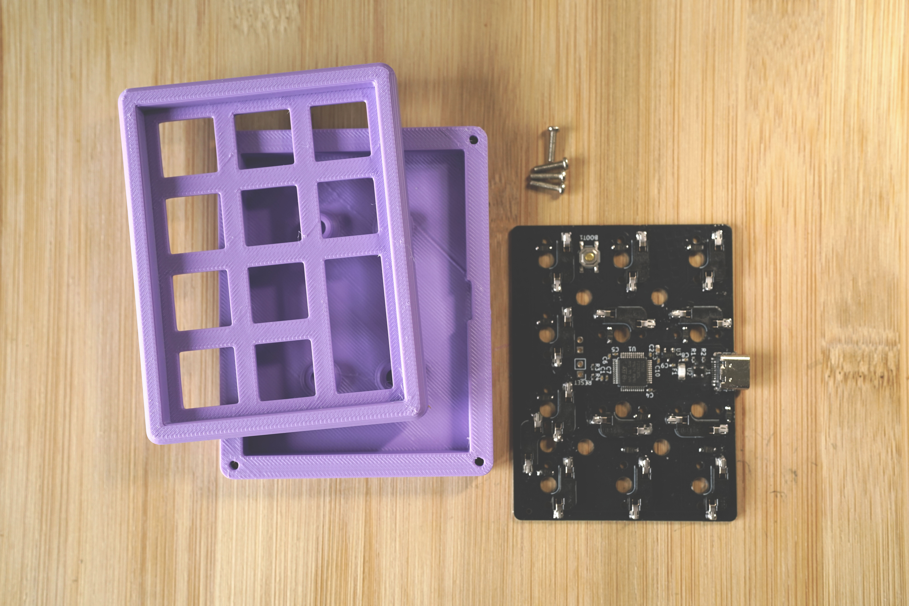
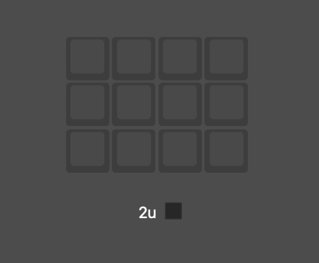
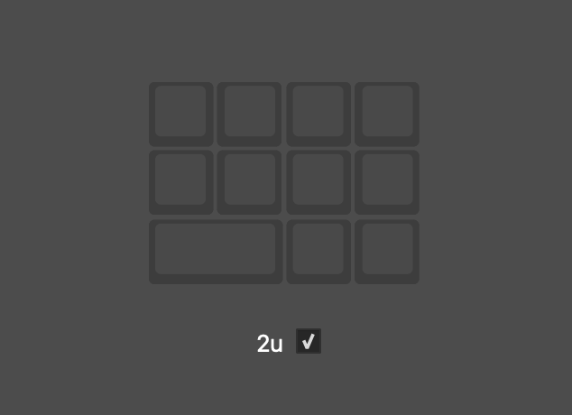

# 4x3 derived

## description 
4x3, four columns and three rows.

Derived, as in derived from the [previous 2x2 macropad](https://github.com/valerietsoi/2squared).

PCB and firmware tested.

Stabless only.

 

## pics
| | |
| --- | --- |
|  | |
|  |  |
|  |  |
 

## firmware

Use [QMK toolbox](https://qmk.fm/toolbox) to flash the pre-compiled `.bin`. Source files to be uploaded.
